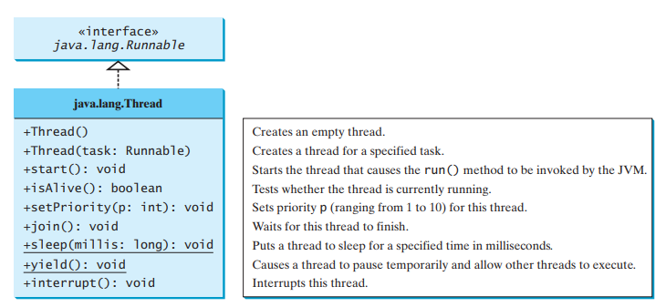

# Thread

## Thread

### Tasks

A program may consist of many tasks that can run concurrently. For example, a word processor let you print or save while you are typing. In java, each task is an instance of the `Runnable` interface.

### Thread

A thread provides the mechanism for running a task. A thread is an object that facilitates the execution of a task.

## Creating Tasks and Threads

A task class must implement the `Runnable` interface. A task must be run from a thread. To create tasks, you have to first define a class for tasks, which implements the `Runnable` interface. All it contains is the `run` method. Put your task in the `run` method, and thread will perform the way you put in the `run` method.



```java
public class Main {
	public static void main(String[] args) {
		// Create an instance of BookingTicket
		BookingTicket task1 = new BookingTicket("task1");
		BookingTicket task2 = new BookingTicket("task2");
		BookingTicket task3 = new BookingTicket("task3");
		// Create a thread of task1
		Thread thread1 = new Thread(task1);
		Thread thread2 = new Thread(task2);
		Thread thread3 = new Thread(task3);
		// Start a thread.
		thread1.start();
		thread2.start();
		thread3.start();
	}
}
```



```java
public class BookingTicket implements Runnable {
	String taskName;

	public BookingTicket(String taskName) {
		this.taskName = taskName;
	}

	/**
	 * Perform the booking ticket task. The number of the total ticket left
	 * decreases after run method
	 */
	@Override
	public void run() {
		System.out.println(this.taskName + " got ticket");

	}
}
```



In the `run()` method, the task is to print this.taskName  got ticket. In order to execute this task, a thread is created for each three tasks in the `Main` class. Call `start()` to start the execution. Here is the output:

> task1 got ticket 
>
> task2 got ticket 
>
> task3 got ticket

## The Thread Class

The `Thread` class contains the constructors for creating threads for tasks and the methods for controlling threads.



Since the `Thread` class implements `Runnable`, you could define a class that extends `Thread` and implements the `run` method.



```java
public class Main {
	public static void main(String[] args) {
		// Create an instance of BookingTicket
		BookingTicketWithThread task1 = new BookingTicketWithThread("task1");
		BookingTicketWithThread task2 = new BookingTicketWithThread("task2");
		BookingTicketWithThread task3 = new BookingTicketWithThread("task3");
		task1.start();
		task2.start();
		task3.start();
		

	}
```



```java
public class BookingTicketWithThread extends Thread{
	String taskName;
	public BookingTicketWithThread(String taskName) {
		this.taskName = taskName;
	}
	/**
	 * Perform the booking ticket task. The number of the total ticket left
	 * decreases after run method
	 */
	@Override
	public void run() {
		System.out.println(this.taskName + " got ticket");

	}

}
```



Here is the output:

> task1 got ticket 
>
> task3 got ticket 
>
> task2 got ticket

## Thread Pools

The previous way is not efficient for a large number of tasks because you have to create a thread for each task. Java provides the `Executor` interface for executing tasks in a thread pool and the `ExecutorService` interface for managing and controlling tasks. `ExecutorService` is a subinterface of `Executor` 


To create an `Executor` object, use the static methods in the `Executors` class. The `newFixedThreadPool(int)` method creates a fixed number of threads in a pool. If a thread completes executing a task, it can be reused to execute another task. If a thread terminates due to a failure prior to shutdown, a new thread will be created to replace it if all the threads in the pool are not idle and there are tasks waiting for execution. The `newCachedThreadPool()` method creates a new thread if all the threads in the pool are not idle and there are tasks waiting for execution




```java
public static void main(String[] args) {
		// Create a fixed thread pool with maximum three threads
		ExecutorService executor = Executors.newFixedThreadPool(3);
		// Submit runnable tasks to the executor
		executor.execute(new BookingTicketWIthRunnable("task1"));
		executor.execute(new BookingTicketWIthRunnable("task2"));
		executor.execute(new BookingTicketWIthRunnable("task3"));

		executor.shutdown();

	}
```



```java
public class BookingTicketWIthRunnable implements Runnable {
	String taskName;

	public BookingTicketWIthRunnable(String taskName) {
		this.taskName = taskName;
	}

	/**
	 * Perform the booking ticket task. The number of the total ticket left
	 * decreases after run method
	 */
	@Override
	public void run() {
		System.out.println(this.taskName + " got ticket");

	}

}
```



Here is the output:

> task3 got ticket
>
>  task2 got ticket
>
>  task1 got ticket

## Thread Synchronization

Threads from same process share the entire contents of the process virtual address space, including its code, data, heap, shared libraries, and open files. A class is said to be thread-safe if an object of the class does not cause a race condition in the presence of multiple threads.



```java
public class Main {
	public static void main(String[] args) {
		Ticket myTicket = new Ticket();
		// Create a fixed thread pool with maximum three threads
		ExecutorService executor = Executors.newFixedThreadPool(3);
		// Submit runnable tasks to the executor
		executor.execute(new BookingTicketWIthRunnable("task1", myTicket));
		executor.execute(new BookingTicketWIthRunnable("task2", myTicket));
		executor.execute(new BookingTicketWIthRunnable("task3", myTicket));

		executor.shutdown();

	}
}
```



```java
public class Ticket {
	int totalTicket = 100;
}
```



```java
public class BookingTicketWIthRunnable implements Runnable {
	String taskName;
	Ticket myTicket;

	public BookingTicketWIthRunnable(String taskName, Ticket myTicket) {
		this.taskName = taskName;
		this.myTicket = myTicket;
	}

	/**
	 * Perform the booking ticket task. The number of the total ticket left
	 * decreases after run method
	 */
	@Override
	public void run() {
		while (myTicket.totalTicket > 0) {
			System.out.println(this.taskName + " got ticket " + myTicket.totalTicket);
			myTicket.totalTicket--;
			try {
				Thread.sleep(100);
			} catch (InterruptedException e) {
				// TODO Auto-generated catch block
				e.printStackTrace();
			}
		}

	}

}
```



> task3 got ticket 100
>
> task1 got ticket 100 
>
> task2 got ticket 100 
>
> task1 got ticket 97 
>
> task3 got ticket 97

`BookingTicketWIthRunnable` class is not thread safe. because different task got same ticket.

### Solution

To avoid race conditions, it is necessary to prevent more than one thread from simultaneously entering a certain part of the program, known as the critical region.

#### The synchronized Keyword

You can use the keyword synchronized to synchronize the method so that only one thread can access the method at a time.

`private synchronized void buyTicket()`



```java
public class Main {
	public static void main(String[] args) {
		Ticket myTicket = new Ticket();
		// Create an instance of BookingTicket
		BookingTicketWIthRunnable task1 = new BookingTicketWIthRunnable(myTicket);
    // Create a thread of task1
		Thread thread1 = new Thread(task1, "A");
		Thread thread2 = new Thread(task1, "B");
		Thread thread3 = new Thread(task1, "C");
		// Start a thread.
		thread1.start();
		thread2.start();
		thread3.start();
	}
}
```



```java
public class BookingTicketWIthRunnable implements Runnable {
	String taskName;
	Ticket myTicket;

	public BookingTicketWIthRunnable(Ticket myTicket) {
		this.myTicket = myTicket;
	}

	/**
	 * Perform the booking ticket task. The number of the total ticket left
	 * decreases after run method
	 */
	@Override
	public void run() {
		while (myTicket.totalTicket > 0) {
			try {
				Thread.sleep(100);
			} catch (InterruptedException e) {
				// TODO Auto-generated catch block
				e.printStackTrace();
			}
			buyTicket();
		}
		

	}

	private synchronized void buyTicket() {
		// TODO Auto-generated method stub
		if (myTicket.totalTicket>0) {
			System.out.println(Thread.currentThread().getName() + " got ticket " + myTicket.totalTicket);
			myTicket.totalTicket--;
		}
		
	}

}
```




In order to lock the synchronized method, it has to be only one object which calls the method. Multiple objects which call the synchronized method would not lock the method.


```java
public class Main {
	public static void main(String[] args) {
		Ticket myTicket = new Ticket();
//		 Create a fixed thread pool with maximum three threads
		ExecutorService executor = Executors.newFixedThreadPool(3);
//		 Submit runnable tasks to the executor
		executor.execute(new BookingTicketWIthRunnable("task1", myTicket));
		executor.execute(new BookingTicketWIthRunnable("task2", myTicket));
		executor.execute(new BookingTicketWIthRunnable("task3", myTicket));

		executor.shutdown();

	}
}
```

This would not work, because there are multiple `BookingTicketWIthRunnable` objects that run the synchronized method

#### Synchronizing Statements

A synchronized statement can be used to acquire a lock on any object, not just this object, when executing a block of the code in a method. This block is referred to as a synchronized block.

`synchronized (expr) { statements; }` expr is a object.



```java
public class Main {
	public static void main(String[] args) {
		Ticket myTicket = new Ticket();
		// Create an instance of BookingTicket
		BookingTicketWIthRunnable task1 = new BookingTicketWIthRunnable(myTicket);
    // Create a thread of task1
		Thread thread1 = new Thread(task1, "A");
		Thread thread2 = new Thread(task1, "B");
		Thread thread3 = new Thread(task1, "C");
		// Start a thread.
		thread1.start();
		thread2.start();
		thread3.start();
	}
}
```



```java
public class BookingTicketWIthRunnable implements Runnable {
	String taskName;
	Ticket myTicket;
	public BookingTicketWIthRunnable(Ticket myTicket) {
		this.myTicket = myTicket;
	}
	/**
	 * Perform the booking ticket task. The number of the total ticket left
	 * decreases after run method
	 */
	@Override
	public void run() {
		while (myTicket.totalTicket > 0) {
			synchronized (this) {
				if (myTicket.totalTicket > 0) {
					System.out.println(Thread.currentThread().getName() + " got ticket " + myTicket.totalTicket);
					myTicket.totalTicket--;
				}
			}
			try {
				Thread.sleep(100);
			} catch (InterruptedException e) {
				// TODO Auto-generated catch block
				e.printStackTrace();
			}
		}
	}
}
```



#### Synchronization Using Locks

Java enables you to acquire locks explicitly, which give you more control for coordinating threads. A lock is an instance of the Lock interface, which defines the methods for acquiring and releasing locks.


ReentrantLock is a concrete implementation of Lock for creating mutually exclusive locks.

```java
public class BookingTicketWIthRunnable implements Runnable {
	String taskName;
	Ticket myTicket;
	Lock lock = new ReentrantLock();

	public BookingTicketWIthRunnable(Ticket myTicket) {
		this.myTicket = myTicket;
	}

	/**
	 * Perform the booking ticket task. The number of the total ticket left
	 * decreases after run method
	 */
	@Override
	public void run() {
		while (myTicket.totalTicket > 0) {
			lock.lock();
			if (myTicket.totalTicket > 0) {
				System.out.println(Thread.currentThread().getName() + " got ticket " + myTicket.totalTicket);
				myTicket.totalTicket--;
			}
			lock.unlock();
			try {
				Thread.sleep(5);
			} catch (InterruptedException e) {
				// TODO Auto-generated catch block
				e.printStackTrace();
			}
		}
	}
}
```


